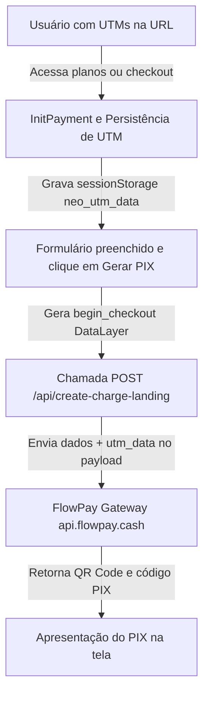

# Manual de Arquitetura e Estrutura do Código (CODEX.md)

Este documento descreve a organização física, o fluxo de dados e os principais componentes da `neo-flw-landing`.

---

## 1. Estrutura de Diretórios e Arquivos

```text
neo-flw-landing/
├── api/                             # Rotas Serverless (Vercel)
│   ├── create-charge-landing.js     # Proxy para a API de cobranças do FlowPay (com UTMs)
│   └── _lib/                        # Bibliotecas internas de processamento
├── checkout/                        # Checkouts individuais (Serviços Unitários)
│   ├── api-whatsapp/
│   ├── app-meta/
│   ├── dashboard-dados/
│   └── webapp-lp/
├── planos/                          # Checkouts de Pacotes / Bundles Completos
│   ├── start/
│   ├── profissional/
│   ├── premium/
│   ├── agents-ia/
│   ├── agente-sdr/
│   ├── crm-inteligente/
│   └── fluxos-automacao/
├── public/                          # Imagens, logotipos e vetores
├── js/
│   └── payment.js                   # Lógica compartilhada do FlowPay e rastreamento UTM
├── css/
│   ├── checkout.css                 # Estilos específicos do fluxo de pagamento
│   └── landing_v2.css               # Estilo visual principal (dark/neon) da home
├── index.html                       # Página inicial do ecossistema
├── safe-page.html                   # Página limpa e institucional servida aos crawlers
├── middleware.js                    # Roteador baseado em User-Agent (proxy para safe-page)
├── vercel.json                      # Configurações de rotas e headers da Vercel
└── Makefile                         # Orquestrador de tarefas locais
```

---

## 2. Fluxo Principal de Vendas e Atribuição



---

## 3. Diretrizes de Segurança de Dados
- **Zero Secrets em bundle público:** Nenhuma chave (`OPENAI_API_KEY`, etc.) deve ser injetada em scripts da pasta `js/` ou arquivos HTML. Toda interação que necessite de tokens privados deve ser enviada a um endpoint na pasta `api/` que consumirá segredos de ambiente no servidor da Vercel.
