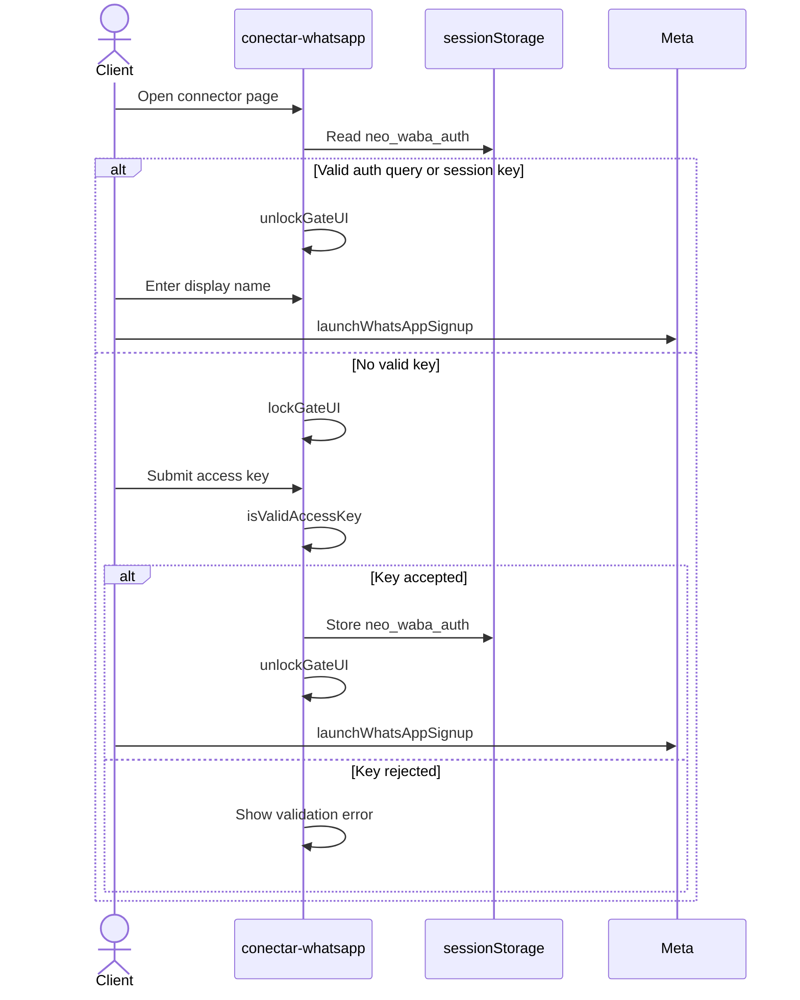

<!-- markdownlint-disable MD003 MD007 MD011 MD013 MD022 MD023 MD025 MD029 MD032 MD033 MD034 -->
# neoflowoff.agency Landing

```text
========================================
       NEOFLOWOFF.AGENCY · LANDING
========================================
Status: ACTIVE
Runtime: Astro static build + Cloudflare Pages Functions
Deploy: Cloudflare Pages
========================================
```

Landing comercial independente da `neoflowoff.agency`.

Publica vitrine estática de serviços, planos e rotas de conformidade para tráfego pago, busca, crawlers e agentes de IA.

────────────────────────────────────────

## ⟠ Contrato

- child repo soberano dentro do workspace `NEO-FlowOFF`
- lockfile pnpm local versionado; `.npmrc` define `ignore-workspace=true` para não herdar o workspace pai
- frontend estático em Astro, sem SSR
- adapter server-side mínimo em `functions/`
- helpers server-side compartilhados em `src/server/`, nunca dentro de `functions/`
- catálogo publicado em `src/data/catalog.json` e hub `/servicos/`
- página dedicada sobre a agência em `/sobre/`
- app oficial homologado na Meta `NEØFLW ENGINE:one` (App ID `1500002841696407`)
- textos de interface em `src/data/ui_texts.json`
- ticker editorial no topo da home com notícias operacionais atuais
- build de produção em `dist/`
- deploy em Cloudflare Pages via Wrangler
- superfícies públicas para agentes: `public/llms.txt`, `public/robots.txt`, `public/sitemap.xml` e `NEO_PROTOCOL.md`
- Google Analytics GA4 carregado por Cloudflare Google Tag Gateway: measurement `G-EQRKXQD7FW`, endpoint first-party `/n4py`, `hideOriginalIp=true` e `setUpTag=false`

Não trate este repositório como backend autoritativo.

Credenciais, cobranças, webhooks e dados privados devem ficar fora do bundle público.

Exceções atuais: `functions/api/meta/embedded-signup.js` recebe o authorization code do Embedded Signup e `functions/api/meta/data-deletion.js` recebe o callback Meta Data Deletion. Ambos devem falhar fechado quando não houver backend soberano, KV ou storage seguro configurado.

O callback local `/api/meta-webhook` e as rotas `/api/whatsapp/send`, `/api/whatsapp/templates` e `/api/health/meta` são superfícies legadas de migração/App Review. Não são o runtime WhatsApp canônico e não devem chamar a Graph API a partir da landing. Webhook, envio, templates e diagnóstico operacional pertencem ao `neo-provider-messaging` em `neo-growth-system`.

O fluxo publico de `/conectar-whatsapp/` usa Facebook Login for Business com Configuration ID `1322930417561011`, mantido em `src/data/config.json` como `integrations.meta.login_configuration_id`. Esse ID nao e secreto. O navegador deve solicitar `response_type: "code"` via `config_id`; a troca do authorization code permanece exclusivamente server-side.

────────────────────────────────────────

## ◬ Rotas & Superfícies Públicas

```text
/                            home comercial com ticker operacional
/servicos/                   catálogo unificado de serviços e soluções
/sobre/                      página institucional da agência e fundador
/tiktok-shop/                porta de entrada para creators e lojistas
/planos/[slug]/              4 planos de operações conectadas
/checkout/[slug]/            8 serviços de implementação unitária
/conectar-whatsapp/          conector WhatsApp via Meta com Access Gate
/privacy/                    política de privacidade pública
/terms/                      termos de serviço
/excluir-dados/              instruções de exclusão de dados e LGPD
/api/meta/data-deletion      callback técnico server-side Meta
```

Rotas de catálogo são alimentadas por `src/data/catalog.json`.

────────────────────────────────────────

## ◯ Identidade Visual

- azul restrito ao bloco Meta no topo
- demais seções usam acid (`#e0ff00`), cinza, preto e branco
- cards devem manter contraste acessível
- elemento do fundador em `/sobre/`: busto 3D de papel origami (`neo-3d-paper.gif`) com sombra elíptica de chão
- ticker superior da home: letreiro de notícias operacionais vivas e auditáveis

────────────────────────────────────────

## ⬡ Especificação do Portal

```text
INTERFACE           neoflowoff.portal
EXECUTION NODE      NEØFLW Engine/01
ORCHESTRATION       NEØ Growth System
ARCHITECTURE        NEØ Protocol
PROVIDER CONNECTOR  Meta Business Messaging
```

────────────────────────────────────────

## ⧆ Fluxo de Acesso & Conexão WhatsApp (Access Gate)



────────────────────────────────────────

## ⦿ Referências

- [SETUP](./SETUP.md)
- [AGENTS](./AGENTS.md)
- [CODEX](./CODEX.md)
- [CLAUDE](./CLAUDE.md)
- [GEMINI](./GEMINI.md)
- [NEO Protocol](./NEO_PROTOCOL.md)
- [NEXTSTEPS](./NEXTSTEPS.md)

```text
────────────────────────────────────────
NΞØ Protocol · FlowOFF Landing
────────────────────────────────────────
```
