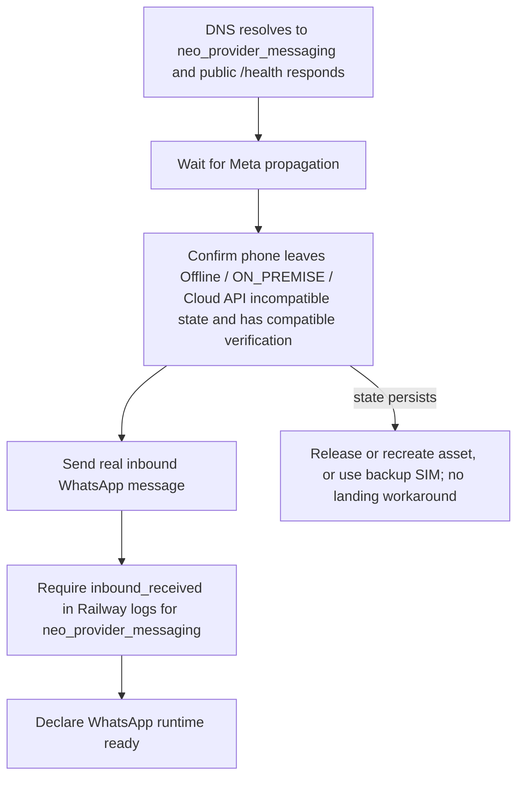

<!-- markdownlint-disable MD003 MD007 MD013 MD022 MD023 MD025 MD029 MD032 MD033 MD034 -->
# SETUP · neo-flw-landing

```text
========================================
       SETUP · NEO-FLW-LANDING
========================================
Runtime: Astro v7 + Cloudflare Pages + Functions
Package Manager: pnpm local isolado
Node: via mise / corepack
========================================
```

Este documento cobre ambiente local, build, deploy e validação.

---

## 1. Pré-requisitos

```text
pnpm        >= 11
Node        >= 20 (via mise ou .nvmrc)
wrangler    >= 4.115 (devDependency, usar via pnpm exec)
```

> **Monorepo:** Este repositório é um child do workspace `NEO-FlowOFF`.
> Nunca execute `pnpm install` global — isso pode quebrar outros projetos.

---

## 2. Instalação isolada

Este checkout é um child repo soberano. O `pnpm-workspace.yaml` local usa
`packages: []`, o `pnpm-lock.yaml` local deve ser versionado e o Makefile
usa `--lockfile-dir .`. O isolamento contra projetos irmãos ou workspaces acima
fica registrado em `.npmrc` por `ignore-workspace=true` e
`shared-workspace-lockfile=false`.

```bash
# correto — instala apenas as dependências deste projeto
make install

# equivalente direto
pnpm install --lockfile-dir .
```

Se o pnpm global falhar por `EPERM` (corepack/mise), use o binário local:

```bash
./node_modules/.bin/astro --version
```

---

## 3. Desenvolvimento local

```bash
make dev

# equivalente
pnpm run dev
# → http://localhost:4321/
```

---

## 4. Build de produção

```bash
make build

# equivalente
pnpm run build
# output: ./dist/
```

O Astro gera rotas estáticas. O `dist/` é artefato — não edite como fonte.

Rotas geradas no build atual:

```text
/                            home
/planos/[slug]/              6 planos completos
/checkout/[slug]/            6 serviços unitários
/conectar-whatsapp/          conector WhatsApp via Meta
/privacy/                    política de privacidade única
/terms/                      termos de serviço único
/excluir-dados/              instruções de exclusão de dados
/404.html
```

---

## 5. Validação antes de publicar

```bash
# build completo (validação mínima obrigatória)
pnpm run build

# lint CSS
./node_modules/.bin/stylelint 'src/styles/**/*.css'

# syntax check do service worker
node --check public/sw.js

# validação do sitemap
xmllint --noout public/sitemap.xml

# testes do callback Meta Data Deletion e conteúdo SSR/build
node --test tests/data-deletion-and-ssr.test.js tests/embedded-signup-storage.test.js tests/meta-webhook.test.js

# atalho local para audit/docs/lint
make verify
```

> `pnpm exec astro check` pode falhar neste checkout por problema interno
> do language server. Não declare typecheck aprovado se falhar; use
> `pnpm run build` como validação mínima.

---

## 6. Deploy

### Via CLI (Wrangler)

```bash
make deploy

# equivalente
pnpm exec wrangler pages deploy dist --project-name=neoflowoff-agency
```

### Via Cloudflare Pages Dashboard (Git deploy)

```text
Build command:  pnpm run build
Output dir:     dist
```

`wrangler.jsonc` declara `pages_build_output_dir: "./dist"`, mas **não**
substitui o comando de build configurado no dashboard.

---

## 7. Cloudflare — configurações ativas

| Recurso                  | Valor                                     |
|--------------------------|-------------------------------------------|
| Project name             | `neoflowoff-agency`                       |
| Output dir               | `./dist`                                  |
| Compatibility date       | `2026-07-23`                              |
| KV binding               | `META_DELETION_REQUESTS`                  |
| KV namespace ID          | `afe76b8c5bf44e2cb4b19f20ebe60081`        |
| KV binding               | `META_CONNECTIONS`                        |
| KV namespace ID          | `f5f62f9206054f7e8191d5a10cd16db8`        |
| Functions dir            | `functions/`                              |
| Google Tag Gateway       | `enabled`                                 |
| Google Tag endpoint      | `/n4py`                                   |
| GA4 measurement ID       | `G-EQRKXQD7FW`                            |
| Hide original IP         | `true`                                    |
| Setup tag automatico     | `false`                                   |

---

## 8. Variáveis de ambiente

O arquivo `.env.example` documenta apenas as variáveis consumidas pelo
runtime atual deste checkout: Cloudflare Pages Functions para Meta
Embedded Signup e Data Deletion Callback.

Copie antes de rodar localmente:

```bash
cp .env.example .env
# edite os valores reais
```

> Nunca commite `.env`. Credenciais e secrets devem ficar fora do bundle.

O endpoint `functions/api/meta/data-deletion.js` exige `META_APP_SECRET`
no ambiente server-side para validar `signed_request` HMAC SHA-256.
Não exponha esse valor em HTML, logs ou scripts públicos.

O endpoint local `functions/api/meta-webhook.js` e as rotas abaixo são
superfícies legadas de migração/App Review. Não configurá-las como runtime
WhatsApp canônico nem usá-las para chamadas Graph API a partir da landing:

```text
/api/whatsapp/send       exige Bearer e whatsapp_business_messaging
/api/whatsapp/templates  exige Bearer e whatsapp_business_management
/api/health/meta         diagnostico sanitizado de WABA/App/webhooks
```

Webhook, envio, templates, diagnóstico operacional e testes reais pertencem ao
`neo-provider-messaging` em `neo-growth-system`.

`META_LOGIN_CONFIGURATION_ID=1322930417561011` e publico e representa a
configuracao oficial do Facebook Login for Business. No build Astro, a fonte
real e `src/data/config.json`; manter `.env.example` e o JSON alinhados quando
o Configuration ID mudar.

O fluxo esperado em `/conectar-whatsapp/`:

```text
button[data-meta-config-id]
  → FB.login({ config_id, response_type: "code", override_default_response_type: true })
  → POST /api/meta/embedded-signup
  → backend soberano / storage seguro troca e guarda o token
```

### Diagrama de Verificação de Prontidão do WhatsApp Runtime



Nao adicionar `scope` paralelo ao `FB.login` enquanto a configuracao do Login
for Business for a fonte canonica de ativos e permissoes.

Bindings KV como `META_DELETION_REQUESTS` e `META_CONNECTIONS` devem ser
configurados na Cloudflare ou no `wrangler.jsonc`; eles não são variáveis
textuais do `.env`.

Helpers server-side compartilhados vivem em `src/server/`.
Nao crie helpers dentro de `functions/`, pois Cloudflare Pages Functions
gera rotas a partir da estrutura de arquivos.

Pagamentos via FlowPay serão tratados por nó externo de pagamentos quando
o contrato runtime estiver pronto. Este checkout Astro ainda não consome
`FLOWPAY_*`, `WOOVI_*` ou `OPENPIX_*`.

---

## 9. Dependências principais

| Pacote                       | Versão        | Função                     |
|------------------------------|---------------|----------------------------|
| `astro`                      | ^7.1.3        | static site generator      |
| `wrangler`                   | ^4.115.0      | deploy CLI Cloudflare      |
| `stylelint`                  | ^17.14.1      | lint CSS                   |
| `stylelint-config-standard`  | ^40.0.0       | ruleset padrão             |
| `@astrojs/check`             | ^0.9.3        | typecheck Astro            |
| `typescript`                 | ^7.0.2        | types                      |

---

## 10. Scripts npm disponíveis

```bash
pnpm run dev        # servidor local
pnpm run build      # build de produção
pnpm run preview    # preview do dist
pnpm run lint       # stylelint --fix
pnpm run deploy     # wrangler pages deploy
pnpm run push       # git add + commit + push main
```

---

## 11. Service Worker

`public/sw.js` deve ignorar ativos internos do Astro para evitar
cache de arquivos dinâmicos:

```text
/_astro/   → bypass
/_image/   → bypass
/src/      → bypass
/api/      → bypass
```

---

## 12. Atualizações do catálogo

- **Catálogo publicado:** `src/data/catalog.json` — alimenta home e rotas dinâmicas
- **Insumo canônico:** `drafts/catalog_v2026_2.json` — não editar sem pedido explícito

Para adicionar um plano ou checkout, edite `catalog.json` e rode `make build`.

---

## 13. Rastreamento e Parâmetros (Pixels & UTMs)

### Pixels Configurados
Tanto o TikTok Pixel quanto o Meta Pixel são inicializados dinamicamente a partir dos IDs definidos no `src/data/config.json`:
- **Meta Pixel ID:** `2051453138833455` (configurado sob `integrations.meta.pixel_id`)
- **TikTok Pixel ID:** `D9IQURBC77U84G6G883G` (configurado sob `integrations.tiktok.pixel_id`)

### Eventos Mapeados (Funil Dinâmico)
Nas páginas `/planos/[slug]` e `/checkout/[slug]`, os seguintes eventos de conversão são disparados:
- **Visualização:** `ViewContent` (Meta/TikTok) no carregamento.
- **Clique no Botão de Contratação:** `InitiateCheckout` (Meta/TikTok) no clique do botão primário `.detail-action--primary`.
- **Clique no WhatsApp:** `Purchase` (Meta) e `CompletePayment` (TikTok) no clique do botão `.detail-action--secondary`, representando a intenção real de contratação.

### Padrão Sugerido de UTMs
Para garantir a rastreabilidade perfeita das campanhas pagas, siga o padrão de nomenclatura abaixo:

| Parâmetro | Valor Sugerido | Descrição | Exemplo |
| :--- | :--- | :--- | :--- |
| `utm_source` | `meta` \| `tiktok` \| `google` | Origem do tráfego (sempre minúsculo) | `utm_source=meta` |
| `utm_medium` | `cpc` \| `paid` | Canal/mídia de veiculação | `utm_medium=cpc` |
| `utm_campaign` | `<slug_do_plano_ou_servico>` | Alinhado com o slug do catálogo | `utm_campaign=agente-sdr` |
| `utm_content` | `<posicionamento_ou_criativo>` | Variante do anúncio/criativo | `utm_content=video-busto-3d` |
| `utm_term` | `<publico_alvo>` | Segmentação/audiência | `utm_term=empresarios-goiania` |

**Exemplo de link parametrizado:**
`https://neoflowoff.agency/planos/agente-sdr?utm_source=meta&utm_medium=cpc&utm_campaign=agente-sdr&utm_content=video-busto-3d`

```text
────────────────────────────
SETUP · neoflowoff-landing
────────────────────────────
```
