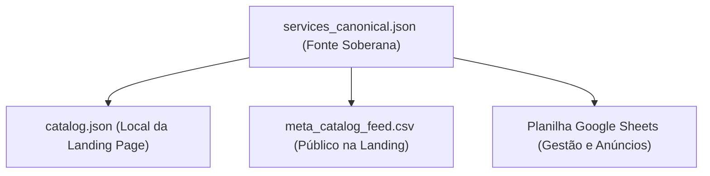

# Padrão de Planilha e Feed de Serviços (Catalog Feed)

Este documento estabelece as especificações técnicas de conformidade e o mapeamento de campos para a planilha de consulta de serviços (utilizada como fonte para feeds de Commerce Manager da Meta e TikTok) e sua sincronização com os ativos locais da agência.

---

## 1. Arquitetura do Catálogo

O ecossistema comercial do ecossistema é alimentado por três camadas que devem permanecer 100% síncronas:

* **services_canonical.json:** Salvo fora do repositório em `~/neomello/_standards/services_canonical.json`. É o contrato soberano de preços, escopos e recursos.
* **catalog.json:** Localizado no projeto em `src/data/catalog.json`. Alimenta a renderização estática da home e rotas dinâmicas.
* **meta_catalog_feed.csv:** Arquivo público gerado em `public/meta_catalog_feed.csv` para consumo automático do Commerce Manager (Meta Catalog).
* **Planilha Google Sheets:** Planilha online editável do operador para sincronização entre campanhas de ads, WABA e catálogos TikTok/Meta.

---

## 2. Padrão de Colunas do Google Sheets

Para manter compatibilidade absoluta com os layouts de importação e evitar rejeições das plataformas de anúncios, a planilha de consulta de serviços deve seguir estritamente o esquema abaixo:

| Nome da Coluna | Tipo | Exemplo de Conteúdo | Regra de Negócio |
| :--- | :--- | :--- | :--- |
| **`item_id`** | String (ID) | `NFO-API-WPP` | Identificador único correspondente ao ID do catálogo. |
| **`Título`** | String | `WhatsApp Business API Oficial` | Título comercial curto do produto/serviço. |
| **`Preço`** | Inteiro | `1500` | Preço cheio de implantação/licença (sem símbolos de moeda). |
| **`Preço Especial`** | String | `1000` ou `2500 x3` | Texto de parcelamento ou valor promocional de campanha. |
| **`link`** | URL | `https://neoflowoff.agency/checkout/api-whatsapp?utm_source=...` | URL canônica de destino (ver tabela de rotas) com UTMs de rastreamento. |
| **`Descrição`** | String (Text) | `Implantação da infraestrutura oficial...` | Descrição limpa, objetiva e sem promessas absurdas para evitar ban da Meta. |
| **`Disponibilidade`** | Enum | `disponível` | Status de estoque. Mapeado no XML/CSV como `in stock`. |
| **`Categoria de produto Google`** | String | `Business & Industrial > Business Services` | Categoria de taxonomia da planilha de produtos do Google. |
| **`image[0].url`** | URL (Imagem) | `https://res.cloudinary.com/...` | URL pública da imagem do item (resolução mínima 500x500px). |
| **`time_padding_after_end`** | Inteiro | `0` | Parâmetro técnico de controle temporal. |
| **`order_index`** | Inteiro | `1` | Índice numérico opcional de prioridade de exibição na Home. |
| **`session_type`** | Enum | `sim` (Plano) ou `não` (Serviço) | Identifica a pasta da rota: `sim` para `/planos/` e `não` para `/checkout/`. |

---

## 3. Rotas Canônicas vs Categorias

Uma das principais falhas de preenchimento é o **deslocamento vertical de links** ou uso de links de planos em serviços e vice-versa. A regra operacional de mapeamento é:

1. **Se `session_type` for `sim` (Plano):**
   A rota padrão obrigatoriamente deve ser na pasta `/planos/<slug>`.
   * *Exemplo:* `/planos/agente-sdr`
2. **Se `session_type` for `não` (Serviço Unitário / Checkout):**
   A rota padrão obrigatoriamente deve ser na pasta `/checkout/<slug>`.
   * *Exemplo:* `/checkout/api-whatsapp`

### Matriz de Mapeamento Oficial de Rotas

| `item_id` | Slug Canônico | Categoria (`session_type`) | Rota de Destino |
| :--- | :--- | :--- | :--- |
| `NFO-A2M-POI` | `a2m-poi-standard` | `não` | `/checkout/a2m-poi-standard` |
| `NFO-API-WPP` | `api-whatsapp` | `não` | `/checkout/api-whatsapp` |
| `NFO-APP-META` | `app-meta` | `não` | `/checkout/app-meta` |
| `NFO-REG-WABA` | `regularizacao-meta-waba` | `não` | `/checkout/regularizacao-meta-waba` |
| `NFO-WEBAPP-LP` | `webapp-lp` | `não` | `/checkout/webapp-lp` |
| `NFO-DASH-DADOS` | `dashboard-dados` | `não` | `/checkout/dashboard-dados` |
| `NFO-AGENTE-SDR` | `agente-sdr` | `sim` | `/planos/agente-sdr` |
| `NFO-AGENTS-IA` | `agents-ia` | `sim` | `/planos/agents-ia` |
| `NFO-CRM-INTEL` | `crm-inteligente` | `sim` | `/planos/crm-inteligente` |
| `NFO-FLUXOS-AUTO` | `fluxos-automacao` | `sim` | `/planos/fluxos-automacao` |
| `NFO-TRAFEGO-META` | `trafego-meta` | `sim` | `/planos/trafego-meta` |
| `NFO-TRAFEGO-GOOG` | `trafego-google` | `sim` | `/planos/trafego-google` |

---

## 4. Otimização para Ads e Catalog Matching

* **Prevenção de Erros de Preço:** A Meta cruza o preço enviado no payload do Pixel/CAPI com o preço presente no Catalog Feed. Se houver divergência gritante (ex: enviar `ViewContent` com value `1000` para um produto cadastrado no catálogo por `1500`), a otimização de anúncios perde eficiência. Sempre mantenha o preço da planilha e do `services_canonical.json` iguais ao disparado no script do cliente.
* **Prevenção de Erros de URL:** Certifique-se de que os domínios nos links estejam unificados (`https://neoflowoff.agency/`). Links antigos apontando para `https://lp.neoflowoff.agency/` devem ser depreciados e atualizados para o domínio canônico único de produção para evitar problemas de rastreamento de subdomínios (Cross-Domain Tracking) no Safari/iOS.
