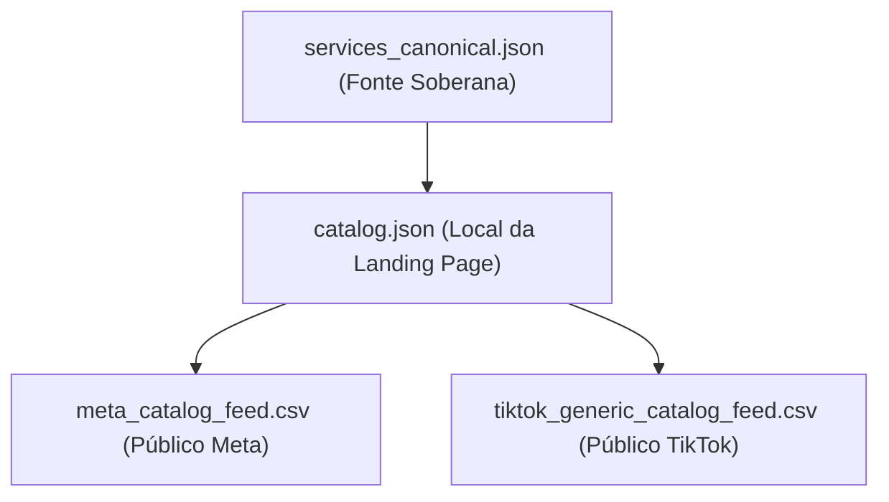

# Padrão de Planilha e Feed de Serviços (Catalog Feed)

Este documento estabelece as especificações técnicas de conformidade e o mapeamento de campos para a planilha de consulta de serviços e sua sincronização com os ativos locais da agência, detalhando a separação de feeds para Meta e TikTok Ads.

---

## 1. Arquitetura do Catálogo

O ecossistema comercial do ecossistema é alimentado por três camadas que devem permanecer 100% síncronas:

* **services_canonical.json:** Salvo fora do repositório em `~/neomello/_standards/services_canonical.json`. É o contrato soberano de preços, escopos e recursos.
* **catalog.json:** Localizado no projeto em `src/data/catalog.json`. É a fonte interna unificada da landing page que alimenta a renderização da home, rotas dinâmicas e disparo dos pixels.
* **meta_catalog_feed.csv:** Arquivo público gerado em `public/meta_catalog_feed.csv` para consumo automático do Commerce Manager da Meta.
* **tiktok_generic_catalog_feed.csv:** Arquivo público gerado em `public/tiktok_generic_catalog_feed.csv` para consumo do TikTok Ads Manager (Generic Catalog).

---

## 2. Automação e Geração de Feeds
Os feeds são gerados dinamicamente a cada build por meio do script [generate_feeds.py](file:///Users/nettomello/neomello/NEO-FlowOFF/neo-flw-landing/scripts/generate_feeds.py). O processo foi automatizado no `package.json` de modo que rodar `pnpm run build` ou `make deploy` automaticamente atualize e publique os arquivos CSV na pasta `public/`.

---

## 3. Matriz de Mapeamento Oficial de IDs e Rotas

Para garantir a correspondência de 100% (*match score*) entre os eventos do Pixel (como `ViewContent` e `InitiateCheckout`) e os feeds do catálogo, todos os sistemas utilizam a mesma chave ID canônica em caixa alta e sem acentos:

| Produto Canônico | ID Canônico (Feed, Pixel, CAPI) | Slug / Rota |
| :--- | :--- | :--- |
| A2M-PoI Standard | `LICENCA-A2M-POI-STANDARD` | `/checkout/a2m-poi-standard` |
| WhatsApp Business API | `SERVICO-API-WHATSAPP` | `/checkout/api-whatsapp` |
| App na Meta | `SERVICO-APP-META` | `/checkout/app-meta` |
| Regularização App Meta & WABA | `SERVICO-REGULARIZACAO-META-WABA` | `/checkout/regularizacao-meta-waba` |
| WebApp & Landing Page | `SERVICO-WEBAPP-LP` | `/checkout/webapp-lp` |
| Dashboard de Dados & BI | `SERVICO-DASHBOARD-DADOS` | `/checkout/dashboard-dados` |
| Agente SDR IA | `PLANO-AGENTE-SDR` | `/planos/agente-sdr` |
| Ecossistema de Agentes de IA | `PLANO-AGENTS-IA` | `/planos/agents-ia` |
| CRM Inteligente | `PLANO-CRM-INTELIGENTE` | `/planos/crm-inteligente` |
| Automações & Integrações | `PLANO-FLUXOS-AUTOMACAO` | `/planos/fluxos-automacao` |
| Gestão de Tráfego Meta | `PLANO-TRAFEGO-META` | `/planos/trafego-meta` |
| Gestão de Tráfego Google | `PLANO-TRAFEGO-GOOGLE` | `/planos/trafego-google` |

---

## 4. Especificações dos Adapters de Distribuição

### A. Meta Commerce Manager Feed (`meta_catalog_feed.csv`)
- **Objetivo:** Alimentar campanhas dinâmicas e o WhatsApp Business Shop no Commerce Manager.
- **Cabeçalhos:** `id`, `title`, `description`, `availability`, `condition`, `price`, `link`, `image_link`, `brand`, `fb_product_category`, `google_product_category`, `custom_label_0`
- **Regras específicas:**
  - `price` é formatado com duas casas decimais e moeda (`5000.00 BRL`).
  - `fb_product_category` e `google_product_category` são mantidos como `Business & Industrial > Business Services` (`503254`) para indicar a natureza B2B profissional.
  - O link de destino contém a tag UTM específica da Meta: `?utm_source=meta_catalog&utm_medium=dynamic_ads&utm_campaign=meta_dynamic_catalog`.

### B. TikTok Ads Generic Catalog Feed (`tiktok_generic_catalog_feed.csv`)
- **Objetivo:** Alimentar campanhas de tráfego de catálogo dinâmico no TikTok Ads Manager.
- **Cabeçalhos:** `item_id`, `id`, `title`, `description`, `price`, `link`, `image_link`, `availability`, `condition`, `brand`, `custom_label_0`
- **Regras específicas de Homologação no TikTok:**
  - Como o TikTok Ads Manager força a seleção de uma indústria (e não possui a opção "Generic Catalog" avulsa em algumas telas), a conta de anúncio deve criar o catálogo sob o setor **`E-commerce`**, mas configurar o campo **`Shipping`** como **`Not applicable (Products won't be shipped)`**. Isso marca os itens como serviços não-físicos.
  - Para atender às regras rígidas de validação de E-commerce do TikTok, o feed exporta a coluna redundante `id` (mapeada como SKU ID no TikTok) e `condition` (com valor `new`), além do `item_id` exigido pela especificação Genérica.
  - O link de destino contém a tag UTM específica do TikTok: `?utm_source=tiktok_catalog&utm_medium=dynamic_ads&utm_campaign=tiktok_generic_catalog`.

